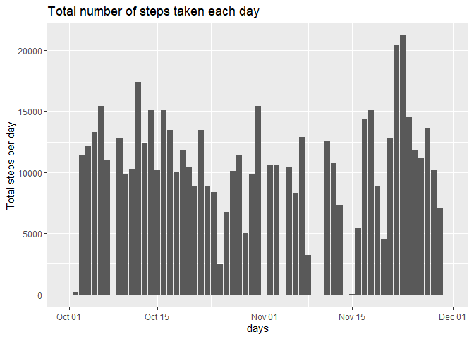
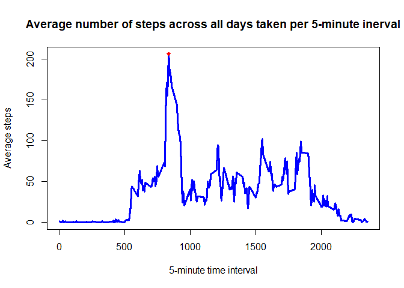
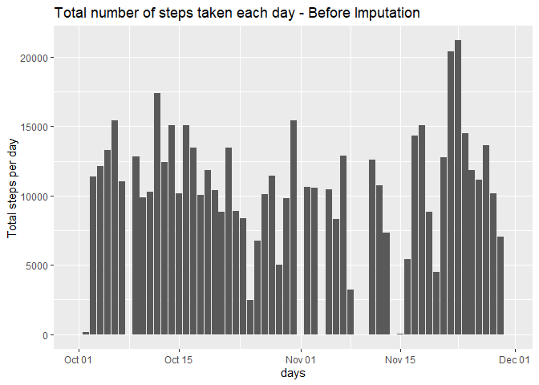
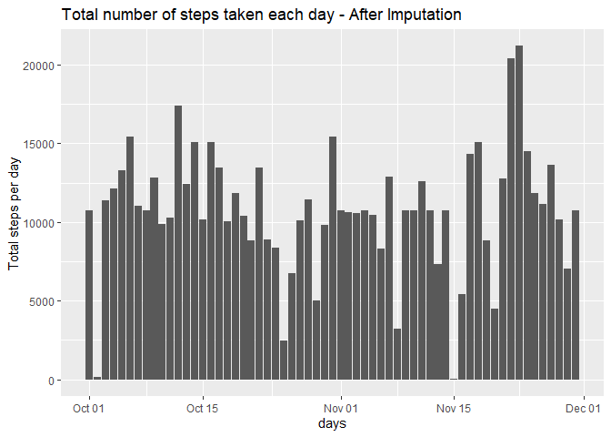
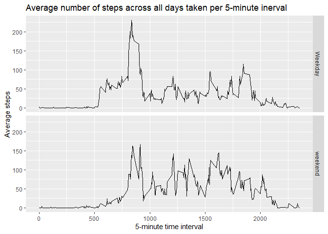

## Loading and preprocessing the data
I`ll be using mainly four libraries for this exercise. THe first "dyplyr" for grouping and summarizing,  "lubridate" for working with dates, "ggplot2" for plotting, and "knitr" for Rmarkdown.


```r
library(dplyr)
```

```
## 
## Attaching package: 'dplyr'
```

```
## The following objects are masked from 'package:stats':
## 
##     filter, lag
```

```
## The following objects are masked from 'package:base':
## 
##     intersect, setdiff, setequal, union
```

```r
library(lubridate)
```

```
## 
## Attaching package: 'lubridate'
```

```
## The following objects are masked from 'package:dplyr':
## 
##     intersect, setdiff, union
```

```
## The following objects are masked from 'package:base':
## 
##     date, intersect, setdiff, union
```

```r
library(knitr)
library(ggplot2)
```


```r
setwd("C:/Users/ecaeshh/Documents/R Programs DIrectory/RepData_PeerAssessment1")

###Checks if file is existing, if not download file & unzip
if(!file.exists("activity.csv")){
        if(!file.exists("activity.zip")) {
                fileurl <-"https://d396qusza40orc.cloudfront.net/repdata%2Fdata%2Factivity.zip"
                download.file(fileurl,getwd())
        }
        unzip("activity.zip",exdir = getwd())
}

activity_df<-tbl_df(read.csv("activity.csv"))
activity_df$date<-as.Date(activity_df$date) #all variables in correct type
```
The read dataframe is called "activity_df". It has three variables of following type:


```r
str(activity_df)
```

```
## tibble [17,568 x 3] (S3: tbl_df/tbl/data.frame)
##  $ steps   : int [1:17568] NA NA NA NA NA NA NA NA NA NA ...
##  $ date    : Date[1:17568], format: "2012-10-01" "2012-10-01" ...
##  $ interval: int [1:17568] 0 5 10 15 20 25 30 35 40 45 ...
```
As can be seen above the steps variable has NA values. lets have a look on the total number of NA values in steps:

```
## [1] 2304
```
## What is mean total number of steps taken per day?
I wil be working with the table while removing NA values, knowing that this will affect the averaging. THere are different of ways dealing with NA values, which we`ll come to it at end of this exercise. For the mean time i will consider removing it. 

Below is the table summarizing total, mean, and median steps taken per day.

```r
dailyactivity_df <- activity_df %>% group_by(date) %>% summarise(dailysteps = sum(steps, na.rm = TRUE),dailymean= mean(steps,na.rm = TRUE),dailymedian= median(steps,na.rm = TRUE ))
```
We can explore the data in a glance with the histogram plot showing the total number of steps taken per day.

```r
g<-ggplot(dailyactivity_df, aes(date, dailysteps))
g<-g + labs(x="days", y="Total steps per day", title="Total number of steps taken each day")
g +geom_bar(stat="identity")
```

<!-- -->


## What is the average daily activity pattern?

The original processed data has gone through another grouping and summarizing to calulate the total, mean, and median steps taken per 5-minute interval, and assigned to dataframe "intervalactivity_df".

```r
intervalactivity_df <- activity_df %>% group_by(interval) %>% summarise(intervalsteps = sum(steps, na.rm = TRUE),intervalmean= mean(steps,na.rm = TRUE),intervalmedian= median(steps,na.rm = TRUE ))
```

Plotting the the average number of steps taken, averaged across all days over 5-minute interval.

```r
with(intervalactivity_df, plot(interval,intervalmean, type="l", main = "Average number of steps across all days taken per 5-minute inerval", lwd=3, ylab = "Average steps", xlab="5-minute time interval", col="blue"))
xmax <-intervalactivity_df[which(intervalactivity_df$intervalmean == max(intervalactivity_df$intervalmean, na.rm = TRUE)),"interval"]
ymax <-intervalactivity_df[which(intervalactivity_df$intervalmean == max(intervalactivity_df$intervalmean, na.rm = TRUE)),"intervalmean"]
points(xmax,ymax, lwd=4, pch=18, col="red")
```

<!-- -->

The point (```{r,echo=FALSE} xmax``` ,```{r,echo=FALSE}ymax```) is the maximum averaged number of steps taken in an interval across all days.
you can see the point in red on the plot.


## Imputing missing values
"Note that there are a number of days/intervals where there are missing values NA. The presence of missing days may introduce bias into some calculations or summaries of the data." As per the course website, there are various ways of dealing with NA values.
FOr our sake, i used the average across the interval. it might come to your mind why i didnt calculate the average across the day. The reason is whenever there is empty value, it is empty over the whole day, where no values collected at all. hence, both median and mean would be NA in such case.

again below is the sum of missing values that will be imputed.

```r
sum(is.na(activity_df$steps)) # count of missing values in steps
```

```
## [1] 2304
```

It makes more sense to take the mean on interval level, as it more reflects the steps that would have been walked at that interval of time.

```r
imputeactivity_df <- activity_df
for (i in 1:length(imputeactivity_df$steps)) { 
        if(is.na(imputeactivity_df[i,"steps"])) 
        {meanimpute <- intervalactivity_df[which(intervalactivity_df$interval %in% imputeactivity_df$interval[i]),"intervalmean"]
        imputeactivity_df[i,"steps"] <- as.integer(round(meanimpute))
        }
}
```
Below is the table summarizing total, mean, and median steps taken per day, with the imputation effect.
The mean of all steps over the days.

```r
imputedailyactivity_df <- imputeactivity_df %>% group_by(date) %>% summarise(dailysteps = sum(steps, na.rm = TRUE),dailymean= mean(steps,na.rm = TRUE),dailymedian= median(steps,na.rm = TRUE ))
mean(imputedailyactivity_df$dailysteps,na.rm = TRUE)
```

```
## [1] 10765.64
```
We can explore the data in a glance with the histogram plot showing the total number of steps taken per day.

```r
g<-ggplot(dailyactivity_df, aes(date, dailysteps))
g<-g + labs(x="days", y="Total steps per day", title="Total number of steps taken each day - Before Imputation")
g +geom_bar(stat="identity")
```

<!-- -->

```r
gi<-ggplot(imputedailyactivity_df, aes(date, dailysteps))
gi<-gi + labs(x="days", y="Total steps per day", title="Total number of steps taken each day - After Imputation")
gi+geom_bar(stat="identity")
```

<!-- -->
We can see the different in couple of days, s you can till with the first bin. however the average is not affected by the imputation.

## Are there differences in activity patterns between weekdays and weekends?

Let`s now discover the whether there is difference in pattern between weekdays and weekends. i will add one factor variable "daytype" with two levels: Weekday, weekend" based on the date.

```r
weekdaysvector<- c("Monday","Tuesday", "Wednesday","Thursday","Friday")
weekendvector<- c("Saturday","Sunday")
imputeactivity_df<-mutate(imputeactivity_df, daytype = "dataype")

for (i in 1:length(imputeactivity_df$steps)) {
        if (weekdays(imputeactivity_df$date[i]) %in% weekdaysvector) {
                imputeactivity_df$daytype[i]<-"Weekday"
        }else{
                if(weekdays(imputeactivity_df$date[i]) %in% weekendvector) {
                        imputeactivity_df$daytype[i]<-"weekend"
                }
        }
        
}
```
I will group the imputeativity data frame by interval and daytype, to understand at each level factor ( weekday or weekend) how the average of steps vary. The table will look as following.

```r
imputeactivity_df <- mutate(imputeactivity_df, daytype = as.factor(daytype))
imputeintervalactivity_df <- imputeactivity_df %>% group_by(interval,daytype) %>% summarise(intervalsteps = sum(steps, na.rm = TRUE),intervalmean= mean(steps,na.rm = TRUE),intervalmedian= median(steps,na.rm = TRUE ))
imputeactivity_df
```

```
## # A tibble: 17,568 x 4
##    steps date       interval daytype
##    <int> <date>        <int> <fct>  
##  1     2 2012-10-01        0 Weekday
##  2     0 2012-10-01        5 Weekday
##  3     0 2012-10-01       10 Weekday
##  4     0 2012-10-01       15 Weekday
##  5     0 2012-10-01       20 Weekday
##  6     2 2012-10-01       25 Weekday
##  7     1 2012-10-01       30 Weekday
##  8     1 2012-10-01       35 Weekday
##  9     0 2012-10-01       40 Weekday
## 10     1 2012-10-01       45 Weekday
## # ... with 17,558 more rows
```
Plotting the average for each weekdays and weekends, show the level of activity on ech. we can see the average level of activity is almost close. However we see spike around interval 750 during the weekday.

```r
wk<-ggplot(imputeintervalactivity_df, aes(interval, intervalmean)) + facet_grid(daytype~.)
wk<- wk +labs(title = "Average number of steps across all days taken per 5-minute inerval")
wk<- wk+ labs(y = "Average steps", x="5-minute time interval")
wk  +geom_line()
```

<!-- -->
